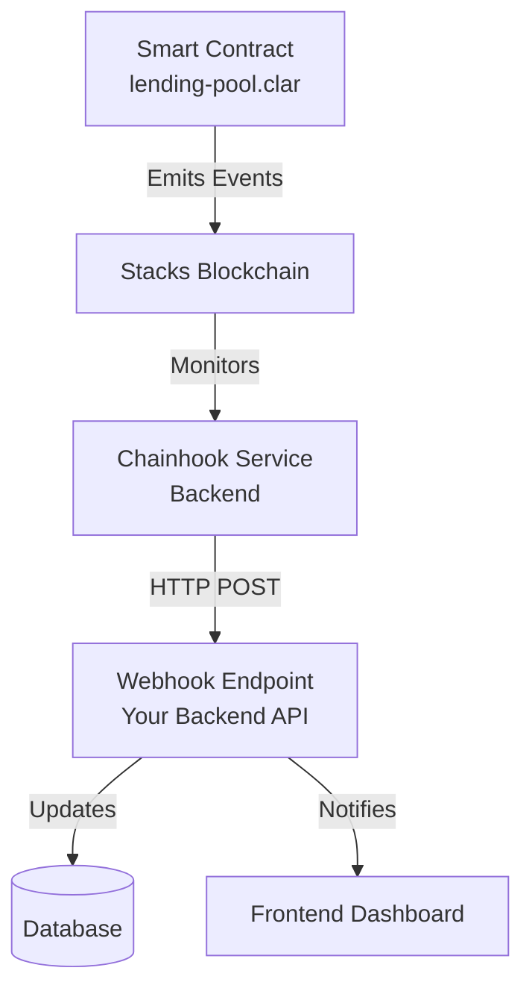

# Chainhook Implementation for StacksLend Protocol

## Overview

Chainhook is a **backend service** that monitors blockchain events and triggers actions when specific conditions are met. It acts as an event-driven middleware between your smart contracts and application services.

## Architecture



## Where Chainhook Fits

**Chainhook is NOT:**
- ❌ Part of the frontend
- ❌ Part of the smart contract
- ❌ A library you import directly

**Chainhook IS:**
- ✅ A standalone backend service (runs separately)
- ✅ An event monitoring system
- ✅ A webhook trigger mechanism

## Directory Structure

```
stacks-lending-protocols/
├── smart-contract/          # Clarity contracts (emit events)
├── frontend/                # React UI (displays data)
├── backend/                 # ✅ Backend API service (THIS REPO)
│   ├── src/
│   │   ├── webhooks/       # Chainhook webhook handlers
│   │   ├── services/       # Business logic
│   │   ├── database/       # Data persistence
│   │   └── api/            # REST endpoints
│   ├── package.json
│   ├── tsconfig.json
│   └── chainhook-config.json
└── @hirosystems/
    └── chainhooks-client/   # Type definitions (reference only)
```

## Implementation Steps

### 1. Dependencies (✅ COMPLETED)

```bash
npm install express @hirosystems/chainhook-client dotenv cors ws
npm install -D typescript @types/express @types/node @types/cors @types/ws
```

### 2. Webhook Handler (✅ IMPLEMENTED)

**File:** `src/webhooks/chainhook-handler.ts`

```typescript
import type { Payload } from '@hirosystems/chainhook-client/dist/schemas/payload';
import express from 'express';
import { handleDeposit, handleBorrow, handleRepay, handleLiquidation } from '../services/lending-events';

const router = express.Router();

router.post('/events', async (req, res) => {
  try {
    const payload: Payload = req.body;
    await processLendingEvent(payload);
    res.status(200).json({ success: true });
  } catch (error) {
    console.error('❌ Chainhook event processing error:', error);
    res.status(500).json({ error: 'Processing failed' });
  }
});

async function processLendingEvent(payload: Payload) {
  for (const block of payload.apply) {
    for (const tx of block.transactions) {
      for (const op of tx.operations) {
        if (op.metadata?.method_name) {
          const functionName = op.metadata.method_name;
          
          switch (functionName) {
            case 'deposit-stx':
              await handleDeposit(tx);
              break;
            case 'borrow-stx':
              await handleBorrow(tx);
              break;
            case 'repay':
              await handleRepay(tx);
              break;
            case 'liquidate':
              await handleLiquidation(tx);
              break;
          }
        }
      }
    }
  }
}

export default router;
```

### 3. Event Handlers (✅ IMPLEMENTED)

**File:** `src/services/lending-events.ts`

Handles deposits, borrows, repayments, and liquidations with in-memory storage.

### 4. Analytics Service (✅ IMPLEMENTED)

**File:** `src/services/analytics.ts`

Calculates TVL, utilization rate, and user analytics.

### 5. REST API (✅ IMPLEMENTED)

**File:** `src/api/routes.ts`

**Endpoints:**
- `GET /api/events` - All events
- `GET /api/events/deposits` - All deposits
- `GET /api/events/borrows` - All borrows
- `GET /api/events/repayments` - All repayments
- `GET /api/events/liquidations` - All liquidations
- `GET /api/events/user/:address` - User's events
- `GET /api/analytics` - Protocol analytics
- `GET /api/analytics/tvl` - Total Value Locked
- `GET /api/analytics/utilization` - Utilization rate
- `GET /api/analytics/user/:address` - User analytics

### 6. Chainhook Configuration

**File:** `chainhook-config.json`

```json
{
  "name": "stackslend-lending-events",
  "version": "1",
  "chain": "stacks",
  "network": "testnet",
  "filters": {
    "events": [
      {
        "type": "contract_call",
        "contract_identifier": "ST1PQHQKV0RJXZFY1DGX8MNSNYVE3VGZJSRTPGZGM.lending-pool",
        "function_name": "deposit-stx"
      },
      {
        "type": "contract_call",
        "contract_identifier": "ST1PQHQKV0RJXZFY1DGX8MNSNYVE3VGZJSRTPGZGM.lending-pool",
        "function_name": "borrow-stx"
      },
      {
        "type": "contract_call",
        "contract_identifier": "ST1PQHQKV0RJXZFY1DGX8MNSNYVE3VGZJSRTPGZGM.lending-pool",
        "function_name": "repay"
      },
      {
        "type": "contract_call",
        "contract_identifier": "ST1PQHQKV0RJXZFY1DGX8MNSNYVE3VGZJSRTPGZGM.lending-pool",
        "function_name": "liquidate"
      }
    ]
  },
  "action": {
    "type": "http_post",
    "url": "http://localhost:3000/chainhook/events"
  }
}
```

## Running the Backend

### Start Backend Server

```bash
# Copy environment template
cp .env.example .env

# Install dependencies (if not done)
npm install

# Development mode
npm run dev

# Production mode
npm run build
npm start
```

Server runs on `http://localhost:3000`

### Start Chainhook Service

**Option A: Using Docker (Recommended)**

```bash
docker run -d \
  --name stackslend-chainhook \
  -p 20456:20456 \
  -v $(pwd)/chainhook-config.json:/config.json \
  hirosystems/chainhook:latest \
  start --config-path=/config.json
```

**Option B: Using Chainhook CLI**

```bash
# Install Chainhook
cargo install chainhook

# Start monitoring
chainhook start --config-path=chainhook-config.json
```

## Use Cases for StacksLend

### 1. Real-Time Dashboard Updates
- Monitor deposits, borrows, repayments in real-time
- Display live transaction feed
- Update TVL (Total Value Locked) automatically

### 2. Liquidation Alerts
- Detect undercollateralized positions
- Send notifications to liquidators
- Track liquidation events

### 3. Analytics & Reporting
- Historical transaction data
- User activity tracking
- Protocol metrics (utilization rate, borrow APY)

### 4. Risk Management
- Monitor large deposits/withdrawals
- Track protocol health
- Alert on unusual activity

## Deployment Architecture

```
┌─────────────────┐
│ Stacks Testnet  │
└────────┬────────┘
         │
         ▼
┌─────────────────┐
│ Chainhook       │ ← Runs as separate service
│ Service         │    (Docker/VPS)
└────────┬────────┘
         │ HTTP POST
         ▼
┌─────────────────┐
│ Your Backend    │ ← Express API (THIS REPO)
│ (Node.js)       │    (Railway/Render/AWS)
├─────────────────┤
│ - Webhooks      │
│ - Database      │
│ - REST API      │
└────────┬────────┘
         │ REST
         ▼
┌─────────────────┐
│ Frontend        │ ← React Dashboard
│ (Next.js)       │    (Vercel)
└─────────────────┘
```

## Testing

```bash
# Test health endpoint
curl http://localhost:3000/health

# Test analytics
curl http://localhost:3000/api/analytics

# Test events
curl http://localhost:3000/api/events
```

## Resources

- [Chainhook Documentation](https://docs.hiro.so/chainhook)
- [Chainhook GitHub](https://github.com/hirosystems/chainhook)
- [Stacks API Reference](https://docs.hiro.so/api)
- [Backend Repository](https://github.com/StacksLend/stackslend-backend)

## Key Takeaway

Chainhook monitors your smart contract events and sends them to your backend. Your backend processes these events, stores data, and serves it to your frontend through REST APIs. This creates a complete event-driven architecture for your lending protocol.